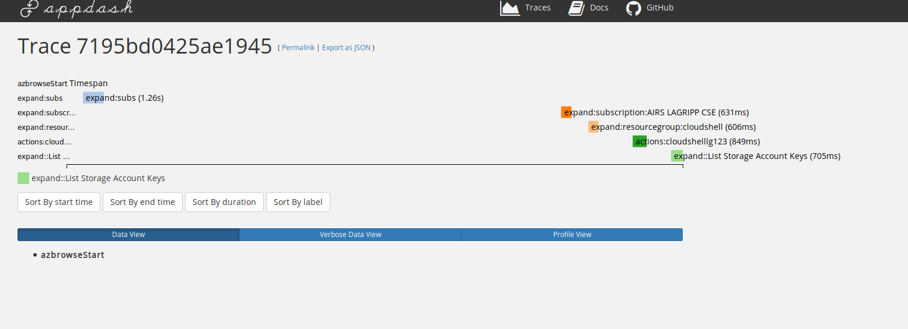

# Contributing

## Developing

### Environment Setup

The repository has a pre-configured `devcontainer` which can be used with VSCode to setup and run a fully configured build environment. 


1. Install [Remote Extensions Pack](https://marketplace.visualstudio.com/items?itemName=ms-vscode-remote.vscode-remote-extensionpack)
2. Clone the Repo and open in VSCode 
4. `CTRL`+`Shift`+`P` -> `Reopen in container` (or `cmd` on mac / however you get to your command panel in VSCode)

The first time you launch with the container a build will occur which can take some time, subsequent launches will use the cache so start immediately. 

## Building

With your Go development environment set up, use `make` to build `azbrowse`.

### What Targets are there?

Run `make help` to see what `targets` exist and what they do or take a look at the `Makefile` yourself. 

Below are the simples ones to get you started.

### Run Tests and Build

``` bash
make build
```

Running integration tests (requires a full terminal)

``` bash
make integration
```

### Install Local Development Build

``` bash
make install
```

## Debugging

Running `azbrowse --debug` will start an in-memory collector for the `opentracing` and a GUI to browse this at http://localhost:8700. You can use this to look at tracing information output by `azbrowse` as it runs.



## Automated builds

The `AzureDevOps` build runs `golang` build, unit tests and linting then runs integration tests under `XTerm`.

To check `golang` build, unit tests and linting pass run `make build` before pushing.

### Running integration tests/release locally

The CI process re-uses the `devcontainer` used for developing the solution locally so you can reproduce build errors locally.

Integration tests in docker:

``` bash
make devcontainer-integration
```

To run the full CI locally, you need to have the `BUILD_NUMBER` environment variable defined, so running it as follows may be easier:

```bash
export BUILD_NUMBER=99999
make devcontainer-release
```

If you would like to do a publish step of the assets set `IS_CI=1`, `BUILD_NUMBER`, `DOCKER_USERNAME`, `DOCKER_PASSWORD`, `BRANCH=master` and `GITHUB_TOKEN` then run `make devcontainer-release`

## Patterns

The aim of this section of the doc is to capture some of the patterns for working with `azbrowse` to add new providers or other features.

If using [Visual Studio Code](https://code.visualstudio.com) and you have the Remote Development extension (+Docker) installed then you can take advantage of the devcontainer support to have a development environment set up ready for you to use.

### Expanders

The hierarchical drill-down from Subscription -> Resource Group -> Resource -> ... is driven by Expanders. These are registered in `registerExpanders.go` and when the list widget expands a node it calls each expander asking if they have any nodes to provide. Multiple expanders can return nodes for any given parent node, but only one expander should mark the response as the primary response.

Each node has an ID and IDs should be unique (to support the `--navigate` command), and typically are the resource ID for the resource in Azure (this allows the `open in portal` action to function)

### APISets

The `SwaggerResourceExpander` is used to drill down within resources. It works against `SwaggerAPISet`s which provide the swagger metadata as well as encapsulating access to the the endpoints identified in the metadata.

The default API Set is `SwaggerAPISetARMResources` which is based on code generated at build time via `make swagger-codegen`. The swagger codegen process loads all of the manamgement plane swagger documents published on GitHub and builds a hierarchy based on the URLs. This is then distilled down into a slightly simpler format based around the `ResourceType` struct. Access to the endpoints in `SwaggerAPISetARMResources` is performed by the `armclient` which piggy-backs on the authentication from the Azure CLI.

Other API Sets can be registered and currently containerService and search are two examples. The Azure Search API Set also uses a `ResourceType` hierarchy generated at build time, but it is dynamically registered with the `SwaggerResourceExpander` when the user expands the "Search Service" node (added by the `AzureSearchServiceExpander`). The API Set instance that is registered at that point has the credentials for authenticating to that specific instance of the Azure Search Service.

The pattern for the container Service API Set is similar: a Kubernetes API node is added by the `AzureKubernetesServiceExpander` and when that is expanded the credentials to the Kubernetes cluster are retrieved and passed to an instance of the API Set. One difference is that the `ResourceType`s for the container service API Set are generated at runtime by querying the Kubernetes API (this allows the node expansion to accurately represent the cluster version as well as any other endpoints that are specific to the cluster)

Issuing `PUT`/`DELETE` requests requires the same authentication as `GET` requests so the `SwaggerResourceExpander` also forwards these to the relevant API Set. (The metadata for the node contains the name of the API Set that returned it)

### Key bindings

Key bindings are initialised in the `setupViewsAndKeybindings` function in `main.go`. Each binding is registered via the `keybindings.AddHandler` function and subsequently bound through the `keybindings.Bind` function.

Handlers implement the `KeyHandler` interface which specifies an ID, an implementation to invoke, the widget that the binding is scoped to, and the default key.

The `ID` and `DefaultKey` functions are both provided by `KeyHandlerBase`. `ID` simply returns the `id` property, and `DefaultKey` performs a lookup in `DefaultKeys` using the ID.

## Testing

### Mocked Tests 

Each `expander` implements a set of `testcases` which mock out the `armclient` responses and assert that the `expander` behaves correct. 

For a good example see the [`default` expanders](https://github.com/lawrencegripper/azbrowse/blob/8b307d3/internal/pkg/expanders/default.go#L84) test set. 

Below is an annotated version of the code for example. 

```golang
    const testPath = "subscriptions/thing"

    // Build an example item which your `expander` should handle
	itemToExpand := &TreeNode{
		ExpandURL: "https://management.azure.com/" + testPath,
    }
    
    // Provide the body of the response you want the ARM client to give when 
    // it's called. 
	const testResponseFile = "./testdata/armsamples/resource/failingResource.json"

	return true, &[]expanderTestCase{
		{
            // This case asserts that the `expander` returns correctly with the `statusIndicator` set correctly
			name:         "Default->Resource",
			nodeToExpand: itemToExpand,
			urlPath:      testPath,
			responseFile: testResponseFile,
            statusCode:   200, // Define Status code the ARM client mock should return when called
            // This function is used to assert the expander result is what you expected \/ 
			treeNodeCheckerFunc: func(t *testing.T, r ExpanderResult) {
				st.Expect(t, r.Err, nil)
				st.Expect(t, len(r.Nodes), 0)

				dat, err := ioutil.ReadFile(testResponseFile)
				if err != nil {
					t.Error(err)
					t.FailNow()
				}
				st.Expect(t, strings.TrimSpace(r.Response.Response), string(dat))
				st.Expect(t, itemToExpand.StatusIndicator, "⛈")
			},
		},
		{
            // This test case asserts that the `expander` returns an error when the ARM client Mock returns a 500 status code. 
			name:         "Default->500StatusCode",
			nodeToExpand: itemToExpand,
			urlPath:      testPath,
			responseFile: testResponseFile,
			statusCode:   500,
			treeNodeCheckerFunc: func(t *testing.T, r ExpanderResult) {
				if r.Err == nil {
					t.Error("Failed expanding resource. Should have errored and didn't", r)
				}
			},
		},
	}
```

### Integration testing/Fuzzing

> WARNING: The fuzzer is EXPERIMENTAL and will talk all subscriptions you have access to and call nodes. Please ensure you use with caution so as not to effect production environments.

In many circumstances the ARM endpoints may return results which can't be predicted from the documentation. 

The only way to test these cases is against a live subscription. `azbrowse` features a [`fuzzer`](https://github.com/lawrencegripper/azbrowse/blob/8b307d3/internal/pkg/automation/fuzzer.go#L30) which will do an automated walk of a subscription. 

You can use the [`shouldSkip` func](https://github.com/lawrencegripper/azbrowse/blob/8b307d3/internal/pkg/automation/fuzzer.go#L51) to limit the number of child nodes walked under a resource or skip a resource. This is useful on items which have unbounded numbers of children like `Activity Log` or `Deployments`. 

You should add assertions about how your items will be handled to [`testFunc`](https://github.com/lawrencegripper/azbrowse/blob/8b307d3/internal/pkg/automation/fuzzer.go#L44) so during the fuzzing checks are made on the results. 

To launch the fuzzer use `azbrowse -fuzzer 1` where `1` is the number of mins to walk the node tree from. 

When working on a particular area you can use the `fuzzer` with the `-navigate` command and it will jump to a node specified then start walking the node tree.

The `make` file provides shortcuts `make fuzz` and `make fuzz-from node_id=/subscriptions/SOMESUB/resourceGroups/lk-scratch/providers/Microsoft.Web/sites/SOMESITE` to build and then fuzz easily. 

In future the intention is to have a test subscription and run the fuzzer during PR builds against a known set of resources defined in the subscription. 