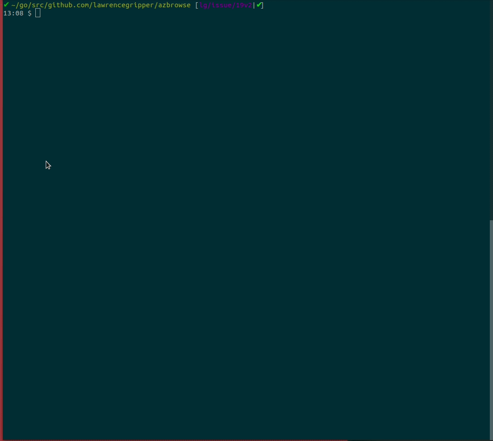

# AzBrowse

An interactive CLI for browsing azure resources, inspired by [resources.azure.com](https://resources.azure.com)

[](https://goreportcard.com/report/github.com/lawrencegripper/azbrowse)
[](http://godoc.org/github.com/lawrencegripper/azbrowse)
[](https://github.com/lawrencegripper/azbrowse/releases/latest)

| Test Type | Status |
| ------------- |:-------------:|
| Unit Tests | [](https://circleci.com/gh/lawrencegripper/azbrowse/tree/master) |
| Integration Tests | [](https://dev.azure.com/lawrencegripper/githubbuilds/_build/latest?definitionId=5&branchName=master) |


### Status

This is a pet project which has matured thanks to support from awesome contributions. 

Currently I'm using it every day **but it is experimental so use with caution on a production environment!!**



### Install

> Pre-req: Ensure you have the [`az` command from Azure CLI](https://docs.microsoft.com/en-us/cli/azure/install-azure-cli?view=azure-cli-latest) setup on your machine and are logged-in otherwise `azbrowse` won't work!

#### Mac (via [HomeBrew](https://brew.sh/))

```
brew install lawrencegripper/tap/azbrowse
```

### Windows (via [Scoop](https://scoop.sh/))

[Install Scoop]([Scoop](https://scoop.sh/))
```
iex (new-object net.webclient).downloadstring('https://get.scoop.sh')
```

Install AzBrowse using Scoop
```
scoop bucket add azbrowse https://github.com/lawrencegripper/scoop-bucket.git
scoop install azbrowse
```

### Install via `azure-cli` extention

Want to run `az browse` and have the `azure-cli` install and run `azbrowse`?

[This extension from Noel Bundick lets you do just that](https://github.com/noelbundick/azure-cli-extension-noelbundick/blob/master/README.md#browse)

#### DIY

Simply download the archive/package suitable for your machine, [from the release page](https://github.com/lawrencegripper/azbrowse/releases), and execute it. 

Bonus: Add it to your `$PATH` so you can run `azbrowse` anywhere. 

#### Test out via Docker 

You can then start `azbrowse` in docker by mounting in your `$HOME` directory so `azbrowse` can access the login details from your machine inside the docker container.

```
docker run -it --rm -v $HOME:/root/ -v /etc/localtime:/etc/localtime:ro lawrencegripper/azbrowse
```

### Usage

Below is a table containing the default key bindings. If you'd like to customise the key bindings to be more suitable for your setup, please refer to the section on [custom key bindings](#custom-key-bindings).

## Navigation

| Key       | Does                                       |
| --------- | ------------------------------------------ |
| ↑/↓       | Select resource                            |
| PgDn/PgUp | Move up or down a page of resources        |
| Home/End  | Move to the top or bottom of the resources |
| Backspace | Go back                                    |
| ENTER     | Expand/View resource                       |

## Operations

| Key                 | Does                      |                                                                                    |
| ------------------- | ------------------------- | ---------------------------------------------------------------------------------- |
| CTRL+E              | Toggle Browse JSON        | For longer responses you can move the cursor to scroll the doc                     |
| CTRL+o (o for open) | Open Portal               | Opens the portal at the currently selected resource                                |
| DEL:                | Delete resource           | The currently selected resource will be deleted (Requires double press to confirm) |
| CTLT+F:             | Toggle Fullscreen         | Gives a fullscreen view of the JSON for smaller terminals                          |
| CTLT+S:             | Save JSON to clipboard    | Saves the last JSON response to the clipboard for export                           |
| CTLT+A:             | View Actions for resource | This allows things like ListKeys on storage or Restart on VMs                      |


## Debugging

Running `azbrowse --debug` will start an in-memory collector for the `opentracing` and a GUI to browse this at http://localhost:8700. You can use this to look at tracing information output by `azbrowse` as it runs.


## Developing

### Environment Setup

> Note: Golang 1.12 is recommended. 

First, clone this repository. `azbrowse` is written in [Go][golang] and so you will want to set up your Go development environment first. If this is your first time, the [offical install guide][installguide] is probably a good place to start. Make sure you have `GOPATH/bin` in your `PATH`, using the instructions [here][gopath] as guidance on doing that.

In addition to installing [Go][golang], there are a couple of tool dependencies you'll need. These are:

- [Golang CI linter][golangcilinter]
- [Dep; Go dependency management tool][golang]

You can install these yourself following the instructions on their github pages, or you can run...

 ``` bash
 make setup
 ```

 This runs the script `scripts/install_dev_tools.sh`, which will install these tools for you.

## Building

With your Go development environment set up, use `make` to build `azbrowse`.

Take a look at the `Makefile` yourself, but the main rules are:

### Run Tests and Build

``` bash
make build
```

Running integration tests (requires a full terminal)
``` bash
make integration
```

### Install Local Development Build


``` bash
make install
```

## Automated builds

The `CircleCI` build runs the `golang` build, unit tests and linting. 
The `AzureDevOps` build run the integration tests under `XTerm`.

### Running locally

``` bash
make integration && make ci-docker 
```

To run the full Travis-CI locally, you need to have the `TRAVIS_BUILD_NUMBER` environment variable defined, so running it as follows may be easier:

```bash
TRAVIS_BUILD_NUMBER=0.1 make ci-docker
```

## Custom Key Bindings

If you wish to override the default key bindings, create a `~/.azbrowse-bindings.json` file (where `~` is your users home directory).

The file should be formated like so:
```json
{
    ...
    "Copy": "F8",
    "Help": "Ctrl+H",
    ...
}
```

In the file you can override the keys for actions using keys from the lists below.

### Actions

| Actions:       | Does                                  |
| ------------------------ | --------------------------------------|
| Quit                     | Terminates the program                |
| Copy                     | Copies the resource JSON to clipboard |
| ListDelete               | Deletes a resources                   |
| Fullscreen               | Toggles fullscreen                    |
| Help                     | Toggles help view                     |
| ItemBack                 | Go back from an item to a list        |
| ItemLeft                 | Switch from the item json to the menu |
| ListActions              | List available actions on a resource  |
| ListBack                 | Go back on a list                     |
| ListBackLegacy           | Go back on a list (legacy terminals)  |
| ListDown                 | Navigate down a list                  |
| ListUp                   | Navigate up a list                    |
| ListRight                | Switch from the list to an item view  |
| ListEdit                 | Toggle edit mode on a resource        |
| ListExpand               | Expand a selected resource            |
| ListOpen                 | Open a resource in the Azure portal   |
| ListRefresh              | Refresh a list                        |

### Keys

- Up
- Down
- Left
- Right
- Backspace
- Backspace2
- Delete
- Home
- End
- PageUp
- PageDown
- Insert
- Tab
- Space
- Esc
- Enter
- Ctrl+2
- Ctrl+3
- Ctrl+4
- Ctrl+5
- Ctrl+6
- Ctrl+7
- Ctrl+8
- Ctrl+[
- Ctrl+]
- Ctrl+Space
- Ctrl+_
- Ctrl+~
- Ctrl+A
- Ctrl+B
- Ctrl+C
- Ctrl+D
- Ctrl+E
- Ctrl+F
- Ctrl+G
- Ctrl+H
- Ctrl+I
- Ctrl+J
- Ctrl+K
- Ctrl+L
- Ctrl+M
- Ctrl+N
- Ctrl+O
- Ctrl+P
- Ctrl+Q
- Ctrl+R
- Ctrl+S
- Ctrl+T
- Ctrl+U
- Ctrl+V
- Ctrl+W
- Ctrl+X
- Ctrl+Y
- Ctrl+Z
- F1
- F2
- F3
- F4
- F5
- F6
- F7
- F8
- F9
- F10
- F11
- F12

> For compatibility reasons you may notice some keys will have multiple mappings.

## Plans

[Issues on the repository track plans](https://github.com/lawrencegripper/azbrowse/issues), I'd love help so feel free to comment on an issue you'd like to work on and we'll go from there.

[golang]: https://golang.org/
[installguide]: https://golang.org/doc/install
[golangcilinter]: https://github.com/golangci/golangci-lint
[golangdep]: https://github.com/golang/dep
[gopath]: https://golang.org/doc/code.html#GOPATH
