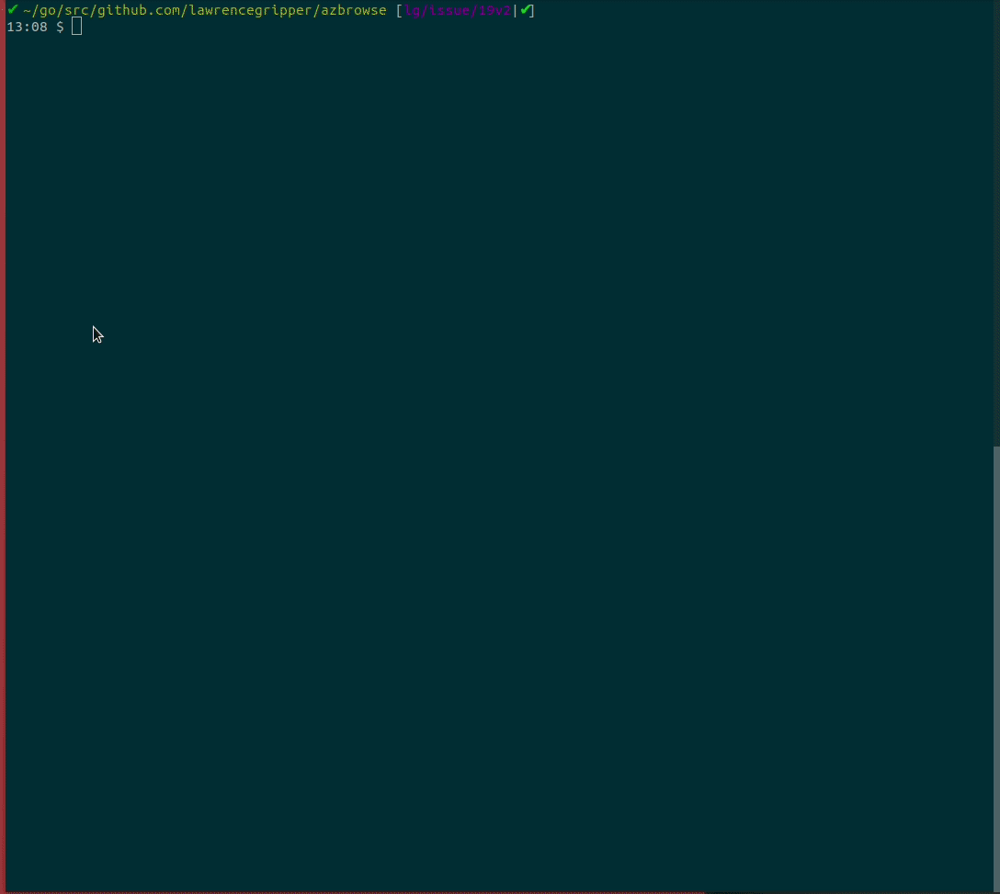

# AzBrowse

An interactive CLI for browsing azure resources, inspired by [resources.azure.com](https://resources.azure.com)

[](https://goreportcard.com/report/github.com/lawrencegripper/azbrowse)
[](http://godoc.org/github.com/lawrencegripper/azbrowse)
[](https://github.com/lawrencegripper/azbrowse/releases/latest)

| Test Type | Status |
| ------------- |:-------------:|
| Unit Tests | [](https://circleci.com/gh/lawrencegripper/azbrowse/tree/master) |
| Integration Tests | [](https://dev.azure.com/lawrencegripper/githubbuilds/_build/latest?definitionId=5&branchName=master) |

## Status

This is a pet project which has matured thanks to support from awesome contributions.

Currently I'm using it every day **but it is experimental so use with caution on a production environment!!**



## Install

> Pre-req: Ensure you have the [`az` command from Azure CLI](https://docs.microsoft.com/en-us/cli/azure/install-azure-cli?view=azure-cli-latest) setup on your machine and are logged-in otherwise `azbrowse` won't work!

### Mac (via [HomeBrew](https://brew.sh/))

```shell
brew install lawrencegripper/tap/azbrowse
```

### Windows (via [Scoop](https://scoop.sh/))

[Install Scoop]([Scoop](https://scoop.sh/))

```shell
iex (new-object net.webclient).downloadstring('https://get.scoop.sh')
```

Install AzBrowse using Scoop

```shell
scoop bucket add azbrowse https://github.com/lawrencegripper/scoop-bucket.git
scoop install azbrowse
```

### Linux (via Releases tar.gz)

Grab the url to the `.tar.gz` for the latest release for your platform/architecture. E.g. `https://github.com/lawrencegripper/azbrowse/releases/download/v1.1.193/azbrowse_linux_amd64.tar.gz`

Download the release (either via the browser or `wget https://github.com/lawrencegripper/azbrowse/releases/download/v1.1.193/azbrowse_linux_amd64.tar.gz`).

Extract the binary from the archive to a suitable location (here we're using `/usr/bin` for convenience): `tar -C /usr/bin -zxvf azbrowse_linux_amd64.tar.gz azbrowse`

Make the binary executable: `chmod +x /usr/bin/azbrowse`

### Install via `azure-cli` extention

> Warning: This is experimental and Non-functional on Windows. Only tested on Unix based systems

Want to run `az browse` and have the `azure-cli` install and run `azbrowse`?

[This extension from Noel Bundick lets you do just that](https://github.com/noelbundick/azure-cli-extension-noelbundick/blob/master/README.md#browse)

#### DIY

Simply download the archive/package suitable for your machine, [from the release page](https://github.com/lawrencegripper/azbrowse/releases), and execute it.

Bonus: Add it to your `$PATH` so you can run `azbrowse` anywhere. 

#### Test out via Docker

You can then start `azbrowse` in docker by mounting in your `$HOME` directory so `azbrowse` can access the login details from your machine inside the docker container.

```shell
docker run -it --rm -v $HOME:/root/ -v /etc/localtime:/etc/localtime:ro lawrencegripper/azbrowse
```

## Plans

[Issues on the repository track plans](https://github.com/lawrencegripper/azbrowse/issues), I'd love help so feel free to comment on an issue you'd like to work on and we'll go from there.

[golang]: https://golang.org/
[installguide]: https://golang.org/doc/install
[golangcilinter]: https://github.com/golangci/golangci-lint
[golangdep]: https://github.com/golang/dep
[gopath]: https://golang.org/doc/code.html#GOPATH
