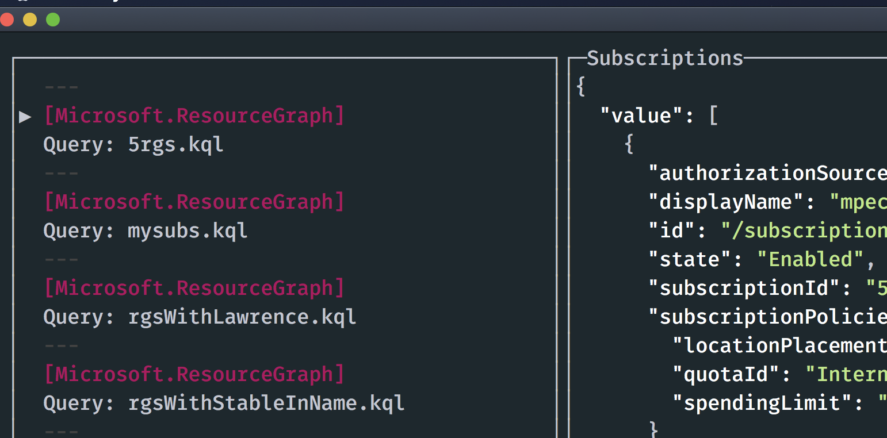
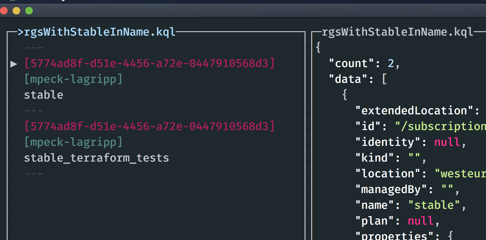

# Custom Views with Azure Resource Graph Queries

This feature lets you write an Azure Resource Graph Query as a view to be shown.

This allows you to group, filter and sort resource groups from multiple subscriptions in one view. 

For each query create a file in `./azurebrowse/queries/` which ends in `.kql`. The file name becomes the name of the query in the UI.

You can launch straight to a set of query results with `azbrowse --navigate queryFileNameHere.kql` where `queryFileNameHere` is the name of your query file.

## Writing your query

Head into the [portal to author your query, there is a good guide here,](https://docs.microsoft.com/en-us/azure/governance/resource-graph/first-query-portal) and author your query interactively.

**NOTE:** Queries must return the following fields:

- `type`
- `id`
- `name`
- `subscriptionId`
- `location`

These are standard fields so unless you use `project` or other advanced query syntax these should appear by default.

Now you have your query returning what you want you can save it in `./azurebrowse/queries/` and you are good to go.

## Simple Example

For a file `./azurebrowse/queries/rgsWithStableInName.kql` with the content

```kusto
// Query finds resources groups beginning with 'stable'
resourcecontainers 
| where type == 'microsoft.resources/subscriptions/resourcegroups' 
| where name contains("stable")
```

You'll see the following in the UI:



You can the open the query and you'll see the resource groups returned by the query:



## Queries

### Resource Container Queries

Show certain resource groups

```kusto
resourcecontainers 
| where type == 'microsoft.resources/subscriptions/resourcegroups' 
| where name contains("stable")
```

// Todo Subscriptions example, contributions welcome

### Resource Queries

All SQL Server instances 

```kusto
Resources
| where type=='microsoft.sql/servers' 
```

All AKS Instances

```kusto
Resources
| where type=~'Microsoft.ContainerService/managedClusters' 
```

It's worth reviewing the Azure Graph docs for more details, complex queries can be written returning items which have certain `tags` or are in a certain `provisioningState` and lot more.