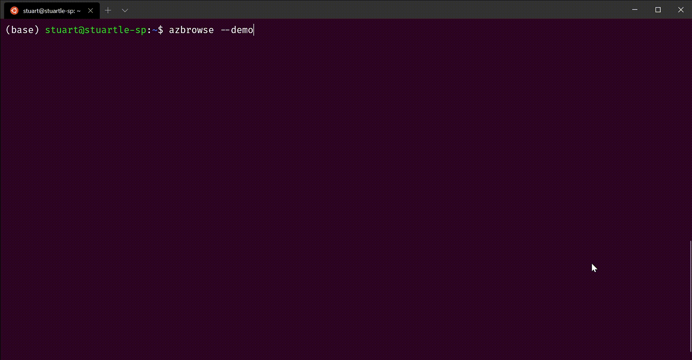

# Getting started

Once you have [installed](../README.md#install) azbrowse you should simply be able to run `azbrowse` from your terminal/command line.

## Layout and navigation

Assuming you haven't yet customised your key bindings, you can use the cursor keys to move the selected item, Enter to select and backspace go back.

The interface for azbrowse has three main sections illustrated below. On the left is the list view - the up and down arrows let you move up and down the list, and you can select items with `Enter`. When you select an item it is shown in the content panel on the right.

At the bottom of the screen is the status bar where messages are displayed to show the progress of actions and errors.

Note that there are a few shortcut keys displayed as prompts in the UI, e.g. `Ctrl+I` for help.

## Commands

`Ctrl+P` will bring up the command palette which shows you what options you have for the currently expanded item as shown below. Where commands have a key binding that is show at the right.

## Guided tours

This section has walk-through videos to guide you through some aspects of azbrowse.

### Filtering, commands and `--navigate`

The up and down arrows are good for exploring the resources that you have, but as you become familiar with where you want to navigate to the filter command can be really helpful. To start, type `/` to bring up the filter panel and then start typing - the items in the list view will be filtered as you type. You can then press `Enter` or `Esc` to dismiss the filter panel and then either navigate the list with cursor keys and `Enter` or clear the filter with `Esc`.

Another great navigation feature is the `--navigate` command line argument which lets you auto-navigate to a resource. To get the ID for a resource you can use the "Copy current resource ID" command from the command palette (`Ctrl+P`)

### Content panel, browse and filter

Using the right allow move the selection to the content panel on the right. Up/Down and PageUp/Down let you navigate and scroll through the response content. 

Typing, using using `/`, lets you filter the content of this panel much like the left list view can be filtered. Use `Esc` to clear a filter and return to the original content.

In the example below I filter the response from a WebApps instance to check for the property `isXenon` and quickly see what it's set to.

### Updating content

For resources that have `PUT` endpoints defined in their API specs, azbrowse allows you to edit the content and send the update.

For example, you can navigate to a site in Azure App Service and then drill in to `config/appsettings` to see the current settings for the site. `Ctrl+U` can then be used to open your configured editor (by default it tries to use Visual Studio code but it is [configurable](./config.md#editing-content)). When you save and close the file, azbrowse will issue the `PUT` request with the new content. If you don't want to make a change then you can close the file without changes, or delete the file content and azbrowse will skip applying the change.

### Metrics

Lots of resources in Azure have metrics defined for them, and azbrowse has support for charting single-value metrics. Simple navigate to the `[Metrics]` node for a resource and pick a metric to display.

### Custom Views over multiple subscriptions

See: [Build custom views from Azure Resource Graph Queries](./docs/azure-resource-graph.md)

### Working with Microsoft Graph
Above the list of subscriptions, you'll see the `MS Graph` menu. This provides access to a subset of MS Graph endpoints for working with AAD. Note that the graph token we use for these calls is retrieved from the Azure CLI, so it doesn't have permission to perform _all_ graph operations. 

Currently implemented are:
- `Me`: A call to the `/me` endpoint, useful to see your own profile data from the tenancy you're connected to.
- `Apps`: For working with AAD Applications. Actions here:
  - `Owned Apps`: Applications you are an owner of. 
  - `New App`: Opens the editor with the minimal `json` to create a new AAD app
  - `Search Apps by Name`: Performs a contains query on the app display name
  - `Get By Object ID`: Get an app by it's **object** ID.
  - For each App listed, you have the following actions:
    - `Update Item`: Opens the editor containing the app `json`, removing the `appId` and `publisherDomain` fields, which cannot be updated. Upon save + close it will perform a `PATCH` call for the app. 
    - `View Owners`: View the owners of that app
- `Service Principals`: For working with AAD Service Principals. In the AAD Portal these are seen as 'Enterprise Applications'. A subset of the search / find operations for apps are available here.

